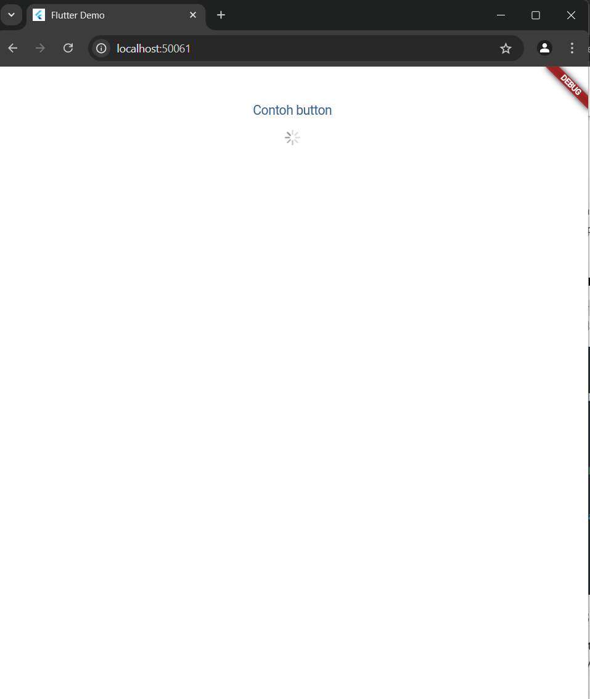

# aplikasitest1

A new Flutter project.

## Getting Started

This project is a starting point for a Flutter application.

A few resources to get you started if this is your first Flutter project:

- [Lab: Write your first Flutter app](https://docs.flutter.dev/get-started/codelab)
- [Cookbook: Useful Flutter samples](https://docs.flutter.dev/cookbook)

For help getting started with Flutter development, view the
[online documentation](https://docs.flutter.dev/), which offers tutorials,
samples, guidance on mobile development, and a full API reference.

NIM : 362358302146
Nama : Moh. Naufal
# praktikum 1
Praktikum ini membahas tentang pembuatan projek baru flutter
# Praktikum 2
Membuat Repository Github
# Praktikum 3
Menerapkan konsep dasar WIdget
Gambar 1()
# Praktikum 4
Menerapkan konsep Widget Meterial Design dan iOS Cupertino
Gambar 1 Cupertino Button dan Loading Bar ()
Gambar 2 FAB()
Gambar 3 Scaffold Widget(Mengatur tataletah button) ()
Gambar 4 Dialog Widget () Setelah tombolnya ditekan ()
Gambar 5 Input dan Selection Widget()
Gambar 6 Date and Time Pickers () Setelah tombolnya ditekan akan muncul tampilan seperti pada gambar ini ()

Kode main.dart yang sekarang adalah tampilan awal atau tampilan yang ada di gambar 1 praktikum 4